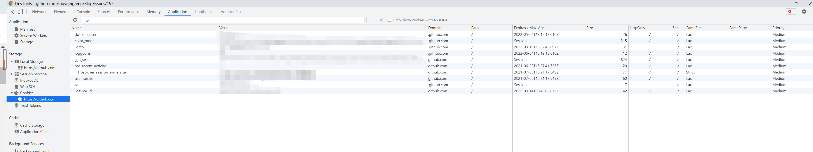
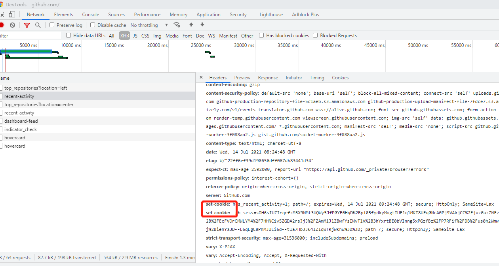

[toc]

## 缓存类型

浏览器第一次请求资源时较为简单，向服务器发起请求并获得响应后向用户显示获取的资源。而在后续发起请求时，采取如下操作：  
1.判断资源缓存的header信息是否命中强缓存(expire和cache-control信息对应资源是否过期)，若命中强缓存，则从本地缓存中获取资源；  
2.否则浏览器便向服务器发出请求，本次请求会携带上一次请求返回的有关缓存的header字段信息（Last-Modified/If-Modified-Since和Etag/If-None-Match），由服务器根据请求中的相关header信息来比对结果是否协商缓存命中；若命中，则服务器返回新的响应header信息，更新缓存中的对应header信息，但是并不返回资源内容，它会告知浏览器可以直接从缓存获取；否则返回最新的资源内容  
  
二者的区别如下表所示：    

| 类型   |  获取资源方式 |  状态码 |是否发送请求到服务器 |
|-------|:------------:|:-------:|-----------------:|
| 强缓存 | 缓存 | 200 | 否 |
|协商缓存 | 缓存 | 304 | 是，由服务器判定缓存是否可用 |

## 浏览器工作原理

### 浏览器的高层结构

 

- 用户界面：包含地址栏、前进/后退按钮和书签菜单等。除了浏览器主窗口显示的请求页面外，其他显示的各个部分都属于用户界面。
- 浏览器引擎 :在用户界面和呈现引擎之间传送指令 
- 渲染引擎:负责显示请求的内容。    
- 网络：用于网络调用，比如HTTP请求。其接口与平台无关，并为所有平台提供底层实现。  
- JavaScript解释器：用于解析和执行JavaScript代码 
- UI后端：用于绘制基本的窗口小部件，比如组合框和窗口 
- 数据持久层  

### 浏览器架构

浏览器架构大致分为两种：

- 单进程：只启动一个进程，该进程中有个多线程工作。
- 多进程：启动多个进程，每个进程里面有多个线程，不同进程通过[IPC](https://en.wikipedia.org/wiki/Inter-process_communication)（Inter-process communication，即进程间通信）进行通信。

目前主流浏览器大多都是多进程多线程模式。

#### 多进程架构

下面以Chrome浏览为例，介绍浏览器的多进程架构。

在Chrome中，主要的进程有四类 ：

- 浏览器进程 (Browser Process)：负责浏览器的Tab页的前进、后退、地址栏、书签栏的工作和处理浏览器的一些不可见的底层操作，比如网络请求和文件读写。
- 渲染进程 (Renderer Process)：负责一个Tab内和网页展示相关的工作，也称渲染引擎。每个tab页对应一个渲染进程，互不影响。
- 插件进程 (Plugin Process)：负责控制网页使用到的所有插件，每种类型的插件对应一个进程，仅当使用该插件时才创建。
- GPU进程 (GPU Process)：负责处理整个应用程序的GPU任务，最多只有一个。


##### 优点

- 更好的容错性——每一个渲染引擎运行在各自的进程中，相互之间不受影响。
- 提供安全性和沙盒性——浏览器可以针对不同进程限制不同的权限，并为其提供沙盒运行环境。
- 更快的响应速度——避免单进程中各个线程任务抢夺CPU资源的问题。

##### 缺点

- 更高的内存消耗——为了节省内存，Chrome会限制被启动的进程数目，当进程数达到一定界限后，会将**访问同一个网站的tab放在一个进程里**

### 参考资料

[浏览器的工作原理：新式网络浏览器幕后揭秘](https://www.html5rocks.com/zh/tutorials/internals/howbrowserswork/)

[Inside look at modern web browser中文翻译](https://juejin.cn/post/6844904046411644941#heading-1)

## 事件循环
### 定义 
根据[HTML标准规范](https://www.w3.org/TR/html5/webappapis.html#event-loops)，为了协调事件、用户交互、脚本、渲染及网络等，用户代理必须使用事件循环。html中定义了event loop的模型，而具体的实现交由不同的浏览器厂商完成。  

### 任务
一个事件循环有一个或多个任务队列——任务队列是任务的有序列表。每一个任务都来自一个特定的任务源，所有来自一个特定任务源并且属于特定事件循环的任务，通常必须被加入到同一个任务队列中，但是来自不同任务源的任务可能会放在不同的任务队列中。  
在JavaScript中，任务被分为Task——有时也称作MacroTask（宏任务），和MicroTask（微任务），分别包含如下内容：

> MacroTask: script(整体代码), setTimeout, setInterval, setImmediate（node独有）,requestAnimationFrame , I/O, UI rendering.  
> MicroTask: process.nextTick（node独有）, Promises, Object.observe(废弃), MutationObserver.

**TODO:是什么特征决定了，某个API是宏任务还是微任务？后续需补充说明**

在同一个上下文中，调用栈的执行顺序为同步代码—>microTask—>macroTask

### 宏任务的处理机制
根据HTML规范中关于事件循环的进程模型：

1. 选择一个最先进入任务队列的任务，如果没有任务可以选择，则会跳转至microtask的执行步骤。
2. 将事件循环的当前运行任务设置为已选择的任务。
3. 运行任务。
4. 将事件循环的当前运行任务设置为null。
5. 将运行完的任务从任务队列中移除。
6. microtask执行步骤：进入microtask检查点。
7. 更新界面渲染。
8. 返回第一步

### 微任务处理机制
当用户代理执行进入microtask检查点且该检查点flag为<i>false</i>时，执行以下步骤：

1. 设置进入microtask检查点的标志为true。
2. 微任务执行处理：当前微任务队列为空时，跳转<i>完成</i>步骤。
3. 选择一个最先进入microtask队列的microtask；
4. 设置事件循环的当前运行任务为已选择的microtask；
5. 运行microtask；
6. 设置事件循环的当前运行任务为null；
7. 将运行结束的microtask从microtask队列中移除。
8. 完成：对于相应事件循环的每个环境设置对象（environment settings object）,通知它们哪些promise为rejected。
9. 清理indexedDB的事务。
10. 设置进入microtask检查点的标志为false。

在事件循环中，用户代理会不断从task队列中按顺序取task执行，每执行完一个task都会检查microtask队列是否为空（执行完一个task的具体标志是函数执行栈为空），如果不为空则会一次性执行完所有microtask。然后再进入下一个循环，去task队列中取下一个task执行,以此类推。

例子如下，具体执行的动态顺序可查看[Jake Archibald的blog](https://jakearchibald.com/2015/tasks-microtasks-queues-and-schedules)：

```javascript
console.log('script start');
setTimeout(function() {
  console.log('setTimeout');
}, 0);
Promise.resolve().then(function() {
  console.log('promise1');
}).then(function() {
  console.log('promise2');
});
console.log('script end');	
```
在Chrome 74和85中的运行结果为
>script start  
>script end  
promise1  
promise2  
setTimeout  

出现如上结果的原因是任务队列分为macrotask（task）和microtask，而Promise中的then方法的函数会被推入microtask队列，而setTimeout的任务会被推入macrotask队列。在每一次事件循环中，macrotask只会提取一个执行，而microtask会一直被提取，直到microtask队列清空。 

## window.requestAnimationFrame()

该方法告诉浏览器——你希望执行一个动画，并且要求浏览器在下次重绘之前调用指定的回调函数更新动画。该方法需要传入一个回调函数作为参数，该回调函数会在浏览器下一次重绘之前执行。

## Cookie

### Cookie定义

​		由于HTTP协议是一个无状态的协议，即同一个客户端连续两次发送请求给服务器时，服务器也识别不出二者是同一个客户端发送的请求。实际应用中为解决这个**客户端和服务端会话状态保持**的问题，引入Cookie这项技术。

​		引用[MDN](https://developer.mozilla.org/zh-CN/docs/Web/HTTP/Cookies)上的定义，Cookie是服务器发送到用户浏览器并保存在本地的一小块数据，它会在浏览器下次向同一服务器再发起请求时被携带并发送到服务器上。

​		按照cookie的生命周期，可以分成两类：

- 会话期Cookie：浏览器关闭之后会被自动删除，即仅在会话期内有效。不需要指定过期时间（Expires）或有效期（Max-Age）。
- 持久性Cookie：生命周期取决于过期时间或有效期指定的一段时间。

### 作用

- 会话状态管理（如用户登录状态、购物车、游戏分数或其它需要记录的信息）
- 个性化设置（如用户自定义设置、主题等）
- 浏览器行为跟踪（如跟踪分析用户行为等）

### 查看Cookie的位置

​		以Github为例，打开chrome浏览器控制台查看**Application**标签页左侧**Cookies**项可查看该网站的cookie信息。



### Cookie的设置

设置步骤大致分为以下4步

1. 客户端发送 HTTP 请求到服务器
2. 当服务器收到 HTTP 请求时，在响应头里面添加一个 Set-Cookie 字段
3. 浏览器收到响应后保存下 Cookie
4. 之后对该服务器每一次请求中都通过 Cookie 字段将 Cookie 信息发送给服务器。

以访问github为例，在Response Headers中可以看到



### Cookie属性

- Name/Value：Cookie保存的键值对

- Domain：指定Cookie可送达的主机名称。若未指定，那么默认值为当前文档访问地址中的主机部分（不包含子域名）。**注意：**不可设置跨域的域名。

- Path：指定一个URL路径，该路径必须出现在请求的资源路径当中。与上文的Domain属性一同定义了Cookie的作用域。

- Expires：用于设置 Cookie 的过期时间。

- Max-Age： 用于设置在 Cookie 失效之前需要经过的秒数。

  - 为0，则会立即删除这个 Cookie。
  - 为正数，浏览器会将其持久化，即写到对应的 Cookie 文件中
  - 为负数，则表示该 Cookie 只是一个会话性 Cookie。

  若Expires 和 Max-Age 都存在，Max-Age 优先级更高。

- HttpOnly：防止客户端脚本通过 document.cookie 等方式访问 Cookie，有助于避免 XSS 攻击。

- Secure：标记为 `Secure` 的Cookie只应通过被HTTPS协议加密过的请求发送给服务端，可以预防中间人攻击。

- SameSite：允许服务器要求某个cookie在跨站请求时不会被发送，从而可阻止CSRF攻击。

  - `None`：浏览器会在同站请求、跨站请求下继续发送cookie，不区分大小写
  - `Strict`：浏览器将只在访问相同站点时发送cookie。
  - `Lax`：与 **`Strict`** 类似，但用户从外部站点导航至URL时（例如通过链接）除外。当前大部分主流浏览器默认选项是Lax，之前是None。

  SameSites各属性值在不同案例下的表现

  | 请求类型 | 实例                                 | None（以前默认） | Strict | Lax（目前默认） |
  | -------- | ------------------------------------ | ---------------- | ------ | --------------- |
  | 链接     | &lt;a href=""&gt;&lt;/a&gt;          | 发送Cookie       | 不发送 | 发送            |
  | 预加载   | &lt;link rel="prerender" href=""&gt; | 发送Cookie       | 不发送 | 发送            |
  | get表单  | &lt;form method="GET" action=""&gt;  | 发送Cookie       | 不发送 | 发送            |
  | post表单 | &lt;form method="POST" action=""&gt; | 发送Cookie       | 不发送 | 不发送          |
  | iframe   | &lt;iframe src=""&gt;&lt;/iframe&gt; | 发送Cookie       | 不发送 | 不发送          |
  | ajax     | $.get()                              | 发送Cookie       | 不发送 | 不发送          |
  | image    | &lt;img src=""&gt;                   | 发送Cookie       | 不发送 | 不发送          |

  

### 参考资料

[浏览器系列之 Cookie 和 SameSite 属性](https://github.com/mqyqingfeng/Blog/issues/157)

[HTTP cookies](https://developer.mozilla.org/zh-CN/docs/Web/HTTP/Cookies)

## 浏览器输入URL到页面加载的过程

从前端工程师角度，大致可归纳为一下6个步骤：

- URL解析
- DNS查询
- TCP连接
- 处理请求
- 接受响应
- 渲染页面

### URL解析

浏览器判断用户输入的内容是一个合法的URL还是一个关键词，如果是合法的URL，浏览器会根据URL协议，在这段内容上加上协议访问该网站；如果是搜索关键词，就将搜索内容+默认搜索引擎合成新的URL访问。

### DNS查询

查询过程分为两种，递归查询和迭代查询。

其中递归查询为：

1. 浏览器缓存
2. 本地的hosts文件
3. 本地DNS解析器缓存
4. 本地DNS服务器

在客户端输入URL后，按照浏览器缓存——本地hosts文件——本地DNS服务器缓存——本地NDS服务器这样的顺序递归查找，在这个过程任一环节查找成功便会结束查找。如果本地DNS服务器无法查询到，则采用迭代查询的方式。

迭代查询的示意图：


### 参考资料

[Inside look at modern web browser中文翻译](https://juejin.cn/post/6844904046411644941#heading-1)

[在浏览器输入 URL 回车之后发生了什么](https://zhuanlan.zhihu.com/p/80551769)

[细说浏览器输入URL后发生了什么](https://juejin.cn/post/6844904054074654728)
