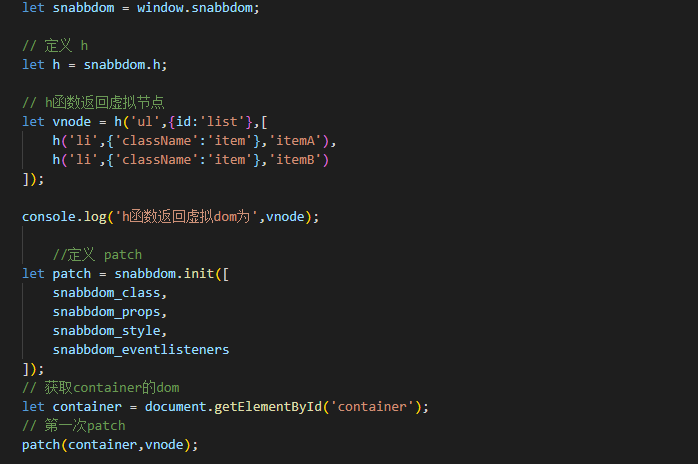
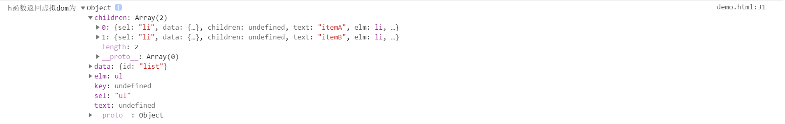
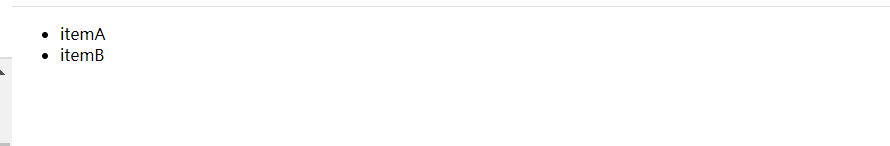
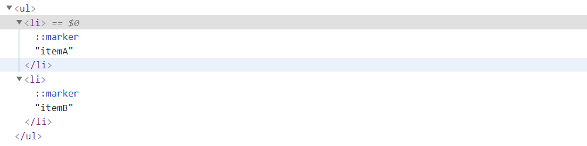
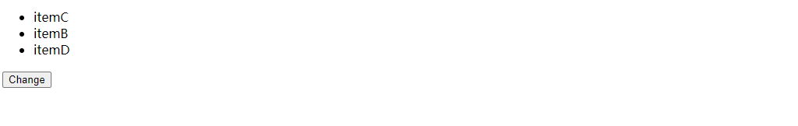

[toc]

## 虚拟DOM

### 定义

Virtual DOM是对DOM的抽象，本质上是JavaScript对象，这个对象就是更加轻量级的对DOM的描述，提高重绘性能。

### 虚拟DOM的优劣

#### 优点

- 保证性能下限: 虚拟DOM可以经过diff找出最小差异，然后批量进行patch，这种操作虽然比不上手动优化，但是比起粗暴的DOM操作性能要好很多——频繁变动DOM会造成浏览器的回流或者重绘，带来一定的性能问题，因此虚拟DOM可以保证性能下限。
- 无需手动操作DOM: 虚拟DOM的diff和patch都是在一次更新中自动进行的，我们无需手动操作DOM，极大提高开发效率。
- 跨平台: 虚拟DOM本质上是JavaScript对象，而DOM与平台强相关，相比之下虚拟DOM可以进行更方便地跨平台操作，例如服务器渲染、移动端开发等等。
- 打开了函数式UI编程的大门。

#### 缺点

- 首次渲染大量DOM时，由于多了一层虚拟DOM的计算，会比 innerHTML 插入慢。虚拟DOM需要在内存中的维护一份DOM的副本。
- 单一的、频繁的更新场景下，虚拟DOM将会花费更多的时间处理计算的工作。比如，你有一个DOM节点相对较少页面，用虚拟DOM，它实际上有可能会更慢。但对于大多数单页面应用，应该都会更快。这也是React和Vue中的更新用了异步的方法，频繁更新时，只更新最后一次的。

### 虚拟DOM实现

以snabbdom.js这个库为例探究实现原理，实现流程大致为3个步骤：

- compile——把真实DOM编译成Vnode虚拟节点。（通过h函数）
- diff——通过算法，知道oldVnode和newVnode之间有什么变化。（内部diff算法）
- patch—— 把这些变化用打补丁的方式更新到真实DOM上去。

下图仅截出核心的实现代码，具体项目创建步骤可查看参考链接博客。

此处代码的核心函数为h()和patch()，其中h函数接收3个参数，分别为DOM元素的***标签名/选择器***、***属性******和以数组形式表示的子节点信息***，最终返回一个虚拟DOM对象，对象的属性信息可查看下图

patch函数接受2个参数，第一个参数表示当前视图的DOM元素或vnode，第二个参数表示需要更新的视图对应的vnode，上图代码截图中第一次调用patch时，新的vnode覆盖了原来的DOM节点（此处是id为container的div元素）——**与React中的render函数在DOM上增加节点不同**。

添加一个按钮，点击时变更ul元素的子节点信息。

此处patch函数将会比对旧的vnode和newVnode的信息，执行效果如下图所示。

### 参考资料

【1】[虚拟dom及dIff算法](https://juejin.cn/post/6844904078196097031)

【2】[snabbdom库](https://github.com/snabbdom/snabbdom)

