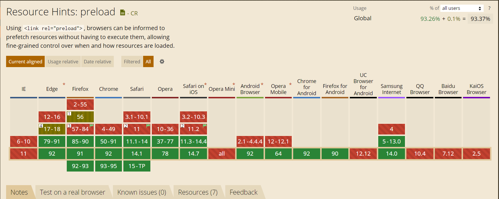
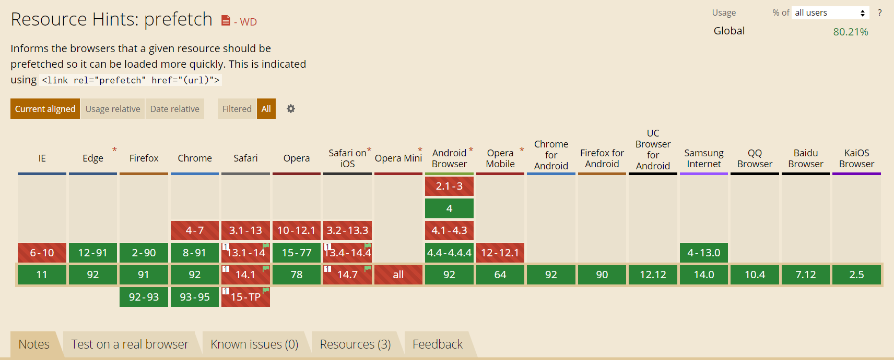
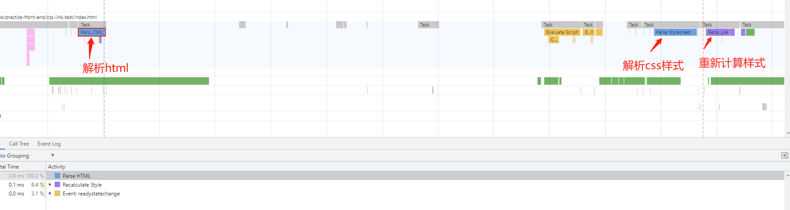
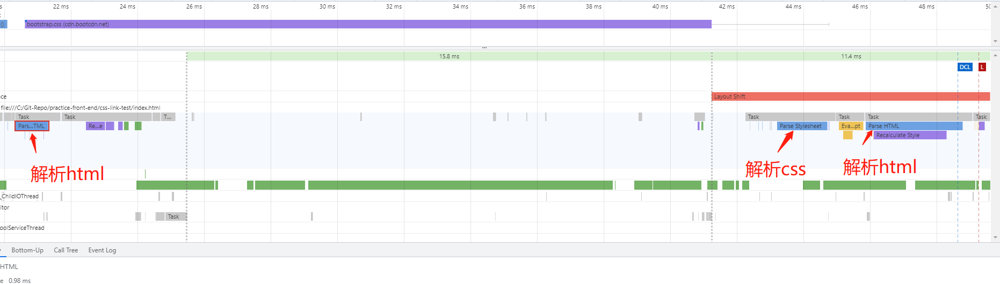
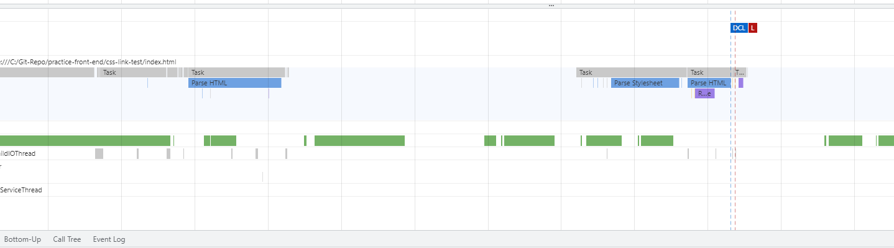

[toc]

---
## HTML 语义化及其优点
语义化是指文本内容的结构化（内容语义化），选择合乎语义的标签（代码语义化），便于开发者在阅读，维护和写出更优雅的代码的同时，让浏览器的爬虫和辅助技术更好地解析。

语义化的优点：  

- 可访问性：帮助辅助技术更好地阅读和转译你的网页，利于无障碍阅读。
- 可检索性：有了良好的结构和语义，可以提高搜索引擎的有效爬取，提高网站流量。
- 可维护性：减少网页间的差异性，方便后期开发和维护。  

常见的语义化标签及其说明：

- &lt;header&gt;：文档或文章的头部信息，如标题、logo 和搜索框
- &lt;nav&gt;：文章的导航栏、链接等；
- &lt;main&gt;：文章的主要内容，在一份文档中是<strong>唯一</strong>的，后代元素常包含&lt;article&gt;。	
- &lt;article&gt;：文档、页面、应用或网站中的独立结构，其意在成为可独立分配的或可复用的结构，如论坛帖子、新闻文章或博客等。
- &lt;section&gt;：表示整体的一部分或文章中的一节，一般来说包含一个标题。
- &lt;aside&gt;：一个和其余页面内容几乎无关的部分，被认为是独立于该内容的一部分并且可以被单独地拆分出来而不会使整体受影响，通常表现为侧边栏或者嵌入内容。
- &lt;footer&gt;：最近一个章节内容或者根节点元素的页脚，通常包含作者、版权信息或者相关链接

此处插入&lt;i&gt;和&lt;em&gt;、&lt;b&gt;和&lt;strong&gt;的比较来澄清语义化上的一些混淆：  

- &lt;i&gt;表示一段普通文本中，因为某种原因和正常文本不同，例如专业术语、外语短语或排版用的文字，其通常表现为斜体，不会改变语义；而&lt;em&gt;表示强调文本内容，强调位置的不同会改变语义，其表现形式也是斜体。
- &lt;b&gt;中的文本通常显示粗体，用于吸引读者的注意力，不具备强调重要性的作用，也不影响语态和语气；&lt;strong&gt;强调内容的重要性、严重性或紧急性。  

具体细节可以查看<a href="http://w3c.github.io/html/textlevel-semantics.html#the-em-element"> W3C 的标签规范文档</a>
## 可替换元素
可替换元素（replaced element）一个内容不受 CSS 视觉格式化模型控制，CSS 渲染模型并不考虑对此内容的渲染，且本身一般拥有固定尺寸的元素。

简单来说，它们的内容不受当前文档的样式的影响。CSS 可以影响可替换元素的**位置**，但不会影响到可替换元素自身的内容。某些可替换元素，例如<i>iframe</i>元素，可能具有自己的样式表，但它们不会继承父文档的样式。

典型的可替换元素有：

- iframe
- video
- embed
- img

有些元素仅在特定情况下被作为可替换元素处理，例如：

- option
- audio
- canvas
- object
- applet

HTML 规范也说了<i>input</i>元素可替换，因为 `"image"` 类型的<i>input</i>元素就像&lt;img&gt;一样被替换。但是其他形式的控制元素，包括其他类型的元素，被明确地列为非可替换元素（non-replaced elements）

用 CSS `content`属性插入的对象是匿名的可替换元素。它们并不存在于 HTML 标记中，因此是“匿名的”

### 参考资料

【1】[MDN](https://developer.mozilla.org/zh-CN/docs/Web/CSS/Replaced_element)

## 行内元素、块级元素与行内块元素比较
### 行内元素
特性：

- 和相邻的行内元素都在一行上，遇到父级元素边界会自动换行。
- 忽略width和height设定值
- 宽度取决于内容
- margin和padding的设定在水平方向上有效，竖直方向上无效。翻阅<a href="https://drafts.csswg.org/css2/box.html#propdef-margin-top">CSS盒子模型的文档</a>可以知晓margin-top和margin-bottom对行内非置换元素无效
- 只能容纳其他行内元素或文本。<strong>Note:根据<a href="http://w3c.github.io/html/textlevel-semantics.html#the-a-element">W3C标签规范文档</a>，虽然&lt;a&gt;是行内元素，但它可以插入&lt;p&gt;、&lt;section&gt;和&lt;table&gt;等块级元素</strong>   

### 块级元素
特性：

- 独占一行
- 可以设置宽度、高度和内外边距
- 默认宽度为父元素宽度
- 可以容纳行内元素和其他块元素  

### 行内块元素
特性：

- 相邻行内元素在同一行，但是之间会有空白缝隙
- 宽度取决于内容
- 宽度、高度、行高、外边距以及内边距都可以设置

可以通过display属性切换这三种元素，如为行内元素设置display：block则变换为块元素。

## js脚本的引入
下面介绍几种引入JavaScript脚本的方式，讨论每种方式的特点和差异，此处不讨论内联式脚本，与正常HTML解析流程一致。
### &lt;head&gt;中引入
在head标签中引入脚本，不设置*defer*和*async*属性，当HTML解析器解析到script标签时，将会去获取js源码并执行代码，此处加载和执行脚本会阻塞HTML的解析流程，如下图所示： 


### &lt;body&gt;末端引入
在body标签尾部中引入脚本，不设置*defer*和*async*属性，HTML解析不需要暂停，当解析完成后脚本加载完毕并执行，如下图所示：


### 在head标签中引入且设置defer属性
当页面在head标签中引入设置*defer*属性的脚本时，HTML页面解析的示意图如下：

从图中可以看出，Javascript脚本是异步加载，当HTML解析完毕时执行。

### 在head标签中引入且设置async属性
当页面在head标签中引入设置*async*属性的脚本时，HTML页面解析的示意图如下：

从图中可以看出，脚本也是异步加载，且加载完毕后阻塞HTML解析，执行脚本完成后恢复解析过程。

### async VS defer

- ```async```方式加载的脚本会在**下载完成后立刻解析并执行**，故而会阻塞HTML解析；而```defer```的脚本在**HTML解析完成后执行**，故不会阻塞HTML解析。
- ```defer```的脚本按照在HTML文档中出现的位置按序加载，而```async```可能乱序。
- 两者可能会阻塞渲染。

由于`async`的脚本可能会阻塞同步脚本（即HTML中普通加载的JS脚本），而同步脚本对于页面中的关键内容很重要，所以在`async`和`defer`间优先选择`defer  `

### 记一次引入脚本的错误

在一次尝试从HTML文件中引入vue.js使用时，误将所有操作的脚本都放在`<head></head>`中引入，发现模板数据没有替换成真实数据。

按照上文的解释，浏览器依照顺序解析HTML时，在*head*标签中加载脚本时，模板数据所在的DOM节点内容尚未加载，此时脚本的操作无效，故一般推荐将脚本放置于*body*标签。

### 参考资料  

[Prefer DEFER Over ASYNC](https://calendar.perfplanet.com/2016/prefer-defer-over-async/)  	
[Efficiently load JavaScript with defer and async](https://flaviocopes.com/javascript-async-defer/)

## preload和prefetch

### preload

preload一种预加载资源的方式，它通过声明向浏览器声明一个需要提交加载的资源，当资源真正被使用的时候立即执行，就无需等待网络的消耗。

它可以通过 `link` 标签进行创建：

```
<!-- 使用 link 标签静态标记需要预加载的资源 -->
<link rel="preload" href="/path/to/style.css" as="style">

<!-- 或使用脚本动态创建一个 link 标签后插入到 head 头部 -->
<script>
const link = document.createElement('link');
link.rel = 'preload';
link.as = 'style';
link.href = '/path/to/style.css';
document.head.appendChild(link);
</script>
```

当浏览器解析到这行代码就会去加载 `href` 中对应的资源但不执行，待到真正使用到的时候再执行；另一种方式方式就是在 HTTP 响应头中加上 `preload` 字段：

```
Link: <https://example.com/other/styles.css>; rel=preload; as=style
```

这种方式比通过 `link` 方式加载资源方式更快，在返回请求结果且还没到解析页面的时候就已经开始预加载资源了。

讲完 `preload `的用法再来看下它的浏览器兼容性，根据 [caniuse](https://caniuse.com/?search=preload)上的介绍：该API的兼容性覆盖率达到 93.37%（文档编写时）。



### prefetch

`prefetch` 跟 `preload` 不同，它的作用是告诉浏览器未来可能会使用到的某个资源，浏览器就会在闲暇时去加载对应的资源，若能预测到用户的行为，比如懒加载，点击到其它页面则相当于提前加载了需要的资源。它的用法跟 `preload`是一样的：

```
<!-- link 模式 -->
<link rel="prefetch" href="/path/to/style.css" as="style">

<!-- HTTP 响应头模式 -->
Link: <https://example.com/other/styles.css>; rel=prefetch; as=style
```

讲完用法再讲浏览器兼容性，根据[caniuse]()上的说明，文档编写时prefetch覆盖率可以达到将近 80.21%。



### 更多细节点

当一个资源被`preload`或者`prefetch`获取后，它将在内存缓存中等待被使用，如果资源存在有效的缓存机制（如 cache-control 或 max-age），那么它将被存储在 HTTP 缓存中供不同页面使用。

正确使用 preload/prefetch 不会造成二次下载，也就说：**当页面上使用到这个资源时候preload资源还没下载完，这时候不会造成二次下载，会等待第一次下载并执行脚本**。

对于`preload`来说，一旦页面关闭了，它就会立即停止`preload`获取资源；而对于`prefetch`资源，即使页面关闭，`prefetch`发起的请求仍会进行不会中断。

### 什么情况会导致二次获取？

- 不要将`preload`和`prefetch`进行混用，它们分别适用于不同的场景，对于同一个资源同时使用`preload`和`prefetch`会造成二次的下载。

- `preload`字体不带`crossorigin`也将会二次获取！确保对`preload`的字体添加`crossorigin`属性，否则会被下载两次，这个请求使用匿名的跨域模式。这个建议既适用于字体文件在相同域名下，也适用于从其他域名获取(比如说默认的异步获取)。

### 小结

`preload`是告诉浏览器页面***必定需要***的资源，浏览器一定会加载这些资源，`prefetch` 是告诉浏览器页面***可能需要***的资源，浏览器不一定会加载这些资源。所以建议：对于当前页面很有必要的资源使用 `preload`，对于可能在将来的页面中使用的资源使用 `prefetch`。

### 这将会浪费用户的带宽吗？

用`preload` 和 `prefetch`情况下，如果资源不能被缓存，那么都有可能浪费一部分带宽，在移动端请慎用。

没有用到的 preload 资源在 Chrome 的console里会在 `onload` 事件 3s 后发生警告。

[](https://camo.githubusercontent.com/d0cebaa34bfe98baf7044e1143bc2ff0ce7c1c112caaa30e245a33751c921f6d/68747470733a2f2f696d672e616c6963646e2e636f6d2f7466732f54423149384f416e6b766f4b31526a535a467758586369434658612d313030302d3238352e706e67)

原因是你可能为了改善性能使用 preload 来缓存一定的资源，但是如果没有用到，你就做了无用功。在手机上，这相当于浪费了用户的流量，所以明确你要 preload 对象。

### 如何检测 preload 支持情况？

用下面的代码段检测浏览器是否支持`<link rel=”preload”>`：

```
const preloadSupported = () => {
    const link = document.createElement('link');
    const relList = link.relList;
    if (!relList || !relList.supports)
        return false;
    return relList.supports('preload');
};
```

### 参考资料

【1】[使用 Proload/Prefetch 优化你的应用](https://github.com/happylindz/blog/issues/17)

## 为何推荐 CSS 在 head 标签中引入

### 准备

利用 Chrome 的 Devtool 提供的*Performance*功能分析网页的各项性能指标，并且会将网页解析渲染流程以图形展示出来。

可参看[这篇掘金文章](https://juejin.cn/post/6844903727728427022)了解基本用法。

### head 标签中引入

```html
<!DOCTYPE html>
<html lang="en">
<head>
    <meta charset="UTF-8">
    <meta http-equiv="X-UA-Compatible" content="IE=edge">
    <meta name="viewport" content="width=device-width, initial-scale=1.0">
    <title>CSS Link Test</title>
    <link href="https://cdn.bootcdn.net/ajax/libs/twitter-bootstrap/1.4.0/css/bootstrap.css" rel="stylesheet">
</head>
<body>
    <p>你好，菜鸡！</p>
</body>
</html>
```



简单描述下浏览器处理html页面的大致过程

1. 浏览器首先解析HTML，生成DOM树
2. 浏览器同步调用网络线程下载<i>bootstrap.css</i>文件，此时HTML尚未渲染；等到css文件下载完毕后，开始解析css样式，生成CSSOM树;之后再结合DOM树和CSSOM树生成Layout树，开始计算布局，绘制内容。

根据上面的流程说明，当外部css在head标签中引入时，HTML的解析步骤正常执行，但渲染步骤会等待css文件下载完毕并解析成功之后再进行，也就是**当css在head标签中引入时，阻塞HTML的渲染。**

### body标签尾部引入

```html
<!DOCTYPE html>
<html lang="en">
<head>
    <meta charset="UTF-8">
    <meta http-equiv="X-UA-Compatible" content="IE=edge">
    <meta name="viewport" content="width=device-width, initial-scale=1.0">
    <title>CSS Link Test</title>
    <!-- <link href="https://cdn.bootcdn.net/ajax/libs/twitter-bootstrap/1.4.0/css/bootstrap.css" rel="stylesheet"> -->
</head>
<body>
    <p>你好，菜鸡！</p>
    <link href="https://cdn.bootcdn.net/ajax/libs/twitter-bootstrap/1.4.0/css/bootstrap.css" rel="stylesheet">
</body>
</html>
```



大致流程：

1. 在解析到link标签之前，浏览器自上而下解析HTML生成DOM树，然后与CSSOM树（非外部引入的CSS）结合生成了Layout树，计算布局之后进行绘制，将页面渲染到浏览器中。
2. 浏览器解析到link标签，下载外部css文件；下载完后开始解析css样式生成CSSOM树，并重新解析HTML生成DOM树；将DOM树和CSSOM树结合生成Layout树，进行计算布局和绘制，完成页面的渲染，这个过程称为**reflow**，也就是回流，是一种消耗性能的现象。

**当外部css在body标签中引入时，不会阻塞HTML的渲染**，所以页面呈现过程应该如下：首先，在css加载完成之前，文本内容先渲染完成，但未带有外部的css样式；css加载完成之后，页面中文本样式发生改变；

### body标签中间引入

```html
<!DOCTYPE html>
<html lang="en">
<head>
    <meta charset="UTF-8">
    <meta http-equiv="X-UA-Compatible" content="IE=edge">
    <meta name="viewport" content="width=device-width, initial-scale=1.0">
    <title>CSS Link Test</title>
    <!-- <link href="https://cdn.bootcdn.net/ajax/libs/twitter-bootstrap/1.4.0/css/bootstrap.css" rel="stylesheet"> -->
</head>
<body>
    <p>你好，菜鸡！</p>
    <link href="https://cdn.bootcdn.net/ajax/libs/twitter-bootstrap/1.4.0/css/bootstrap.css" rel="stylesheet">
    <p>Hello,Newbie！</p>
</body>
</html>
```



**当css在body标签中引入时，阻塞HTML的解析，但不阻塞HTML的渲染。**

### 参考资料

【1】[为什么 CSS 要在 head 标签中引入](https://zhuanlan.zhihu.com/p/268726432)

