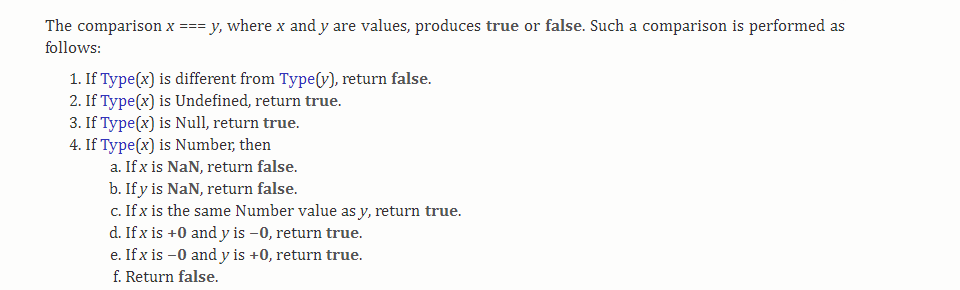
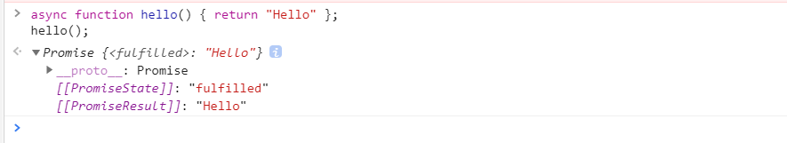

# JavaScript知识点

- 原型与原型链
- 作用域与闭包
- 继承
- 浅拷贝与深拷贝
- 箭头函数和普通函数的区别
- 柯里化
- == 和 === 相等运算符的区别
- Promise对象
- 浮点数的计算
- 手动创建一个bind()
- clone一个对象
- 深度冻结
- 回调
- 判断两个对象是否值相等
- 跨域资源共享（CORS）
- 事件代理
- 事件流
- 真值和假值
- 数组map()和forEach()的区别
- 提升（Hoisting）
- null和undefined的区别
- 创建对象
- typeof typeof 0
- var、let和const及无关键字声明
- 事件驱动编程
- 命令式编程和声明式编程
- 缓存代理模式
- 严格模式
- 虚拟DOM
- new操作符的自定义
- 防抖与节流

---
## 原型与原型链
### 原型
在javascript中，函数可以有属性。每个函数都有一个特殊的属性叫作原型（prototype），这个属性是一个指针，指向一个包含由特定类型的所有实例共享的属性和方法的对象。在默认情况下，所有的原型对象会自动获得一个*constructor*属性，该属性包含一个指向原型(prototype)属性所在函数的指针。下方的例子中Person.prototype.constructor指向Person  

```javascript
function Person(){}
Person.prototype
```
  
当调用构造函数创建一个实例后，该实例的内部将包含一个指向构造函数的原型对象的指针。ECMA 262第5版中管这个指针叫[[Prototype]]，虽然在脚本中没有标准的方式访问该指针，但大多数浏览器为每个对象提供了*__proto__*属性指向原型，如下图所示。  
  
关于实例、构造函数以及原型的关系可借由下图理解  

### 原型链
原型链的基本思想是利用原型让一个引用类型继承另一个引用类型的属性和方法。

```javascript
function SuperType(){
	this.value = true;
}
SuperType.prototype.getSuperValue = function (){
	return this.value;
}
function SubType(){
	this.subValue = false;
}
SubType.prototype = new SuperType();
SubType.prototype.getSubValue = function (){
	return this.subValue;
}
var instance = new SubType();
console.log(instance.getSuperValue); //true
```
如上代码实现了一个原型链，instance的原型指向SubType的原型，而SubType的原型指向了SuperType的原型，此时的instance.constructor指向SuperType，这是因为原来的SubType的constructor别重写的缘故。  


## 作用域与闭包
### 词法作用域
作用域（Scope）就是一套规则，用于确定变量在何处以及如何查找变量（标识符）的规则。词法作用域也叫静态作用域，是指函数的作用域在函数定义的时候就已经决定了。作用域链是指在查询某个变量时，从当前函数作用域向外层查找的一条路径
### 闭包
闭包是定义在另一个函数内部可以访问外部函数的词法作用域，即使是宿主函数在词法作用域外执行。闭包可以在三种作用域中访问变量：

- 定义在自己作用域下的变量
- 定义在父函数作用域下的变量
- 定义在全局作用域的变量  

在JavaScript中，所有的函数都是闭包，因为它们可以访问外部作用域，但是大多数函数并没有利用好闭包的有效性：状态的持久性。因此闭包有时也叫有状态函数

此外，闭包是唯一一种存储私有数据不能被外部访问的方式。它们是UMD（Universal Module Definition，通用模块定义）模式的关键，它已经在许多库中熟练地被使用，只暴露一个公共的API，隐藏私有的实现细节，阻止了在用户代码中和其他库的命名冲突
## 继承
### 原型链
参看上述原型链章节，但由于原型中包含引用类型和创建子类型的实例时无法向父类的构造函数的原因，实践中很少单独使用原型链。		
### 借用构造函数/伪造对象/经典继承
思想：在子类型的构造函数中调用父类构造函数，如下代码：

```javascript
function SuperType(){
	this.colors = ['red', 'green', 'blue'];
}
function SubType(){
	SuperType.call(this)
}
var instance = new SubType();
instance.colors.push('yellow');
console.log(instance.colors);//"red, green, blue, yellow"
var instance1 = new SubType();
console.log(instance1.colors);//"red, green, blue"
```
问题：方法都在构造函数中定义，达不到函数复用的效果；父类的原型中定义的方法，子类不可见。因此，该技术也很少单独用。
### 组合继承
结合原型链和借用构造函数，使用原型链实现对原型属性和方法的继承，借用构造函数实现对实例属性的继承。

```javascript
function SuperType(name){
	this.name = name;
	this.colors = ['red', 'green', 'blue'];
}
SuperType.prototype.sayName = function(){
	console.log(this.name);
}
function SubType(name, age){
	SuperType.call(this,name);
	this.age = age;
}
SubType.prototype = new SuperType();
SubType.prototype.sayAge = function(){
	console.log(this.age);
}
var instance = new SubType('David', 25);
instance.colors.push('yellow');
console.log(instance.colors);//"red, green, blue, yellow"
instance.sayName();//"David"
instance.sayAge();//25
var instance1 = new SubType('Greg', 27);
console.log(instance1.colors);//"red, green, blue"
instance.sayName();//"Greg"
instance.sayAge();//27
```
组合继承避免了原型链和借用构造函数的缺陷，融合了它们的优点，是JavaScript中常用的继承模式。
### 原型式继承
由Douglas Crockford在其文章[《Prototypal Inheritance in JavaScript》](https://www.crockford.com/javascript/prototypal.html)中提出，借助原型可以基于已有的对象创建新对象，不必创建自定义类型。如下代码：  

```javascript
function object(o){
	function F(){}
	F.prototype = o;
	return new F();
}
```
ECMAScript 5通过新增Object.create()方法规范了原型式继承。
### 寄生式继承
该继承方式同样由Crockford推而广之，思路是创建一个封装继承过程的函数。代码如下：  

```javascript
function createAnother(o){
	let clone = Object.create(o);
	clone.sayHi = function(){
		console.log('hi');
	}
	return clone;
}
```
### 寄生组合式
为改善组合式继承中两次调用父类的构造函数而提出，该方法借助构造函数继承属性，借助原型链继承方法——本质上是使用寄生式继承来继承父类的原型，再将结果指定给子类型。基本模式：

```javascript
function inheritPrototype(subType,superType){
	let prototype = Object.create(superType.prototype);
	prototype.constructor = subType;
	subType.prototype = prototype;
}
```
该函数接收两个参数：子类和父类的构造函数。第一步，创建父类原型的副本；第二步，为该副本添加constructor属性，以弥补重写原型而失去的默认constructor属性；最后一步，将副本赋值给子类型原型。
示例代码如下：  
```javascript
function SuperType(name){
	this.name = name;
	this.colors = ['red', 'green', 'blue'];
}
SuperType.prototype.sayName = function(){
	console.log(this.name);
}
function SubType(name, age){
	SuperType.call(this,name);
	this.age = age;
}
inheritPrototype(SubType,SuperType);
SubType.prototype.sayAge = function(){
	console.log(this.age);
}
```
## 浅拷贝和深拷贝
浅拷贝一般通过Object.assign({},obj)  ；深拷贝的代码如下：

```javascript
funciton deepClone() {
	let clone = Object.assign({}, obj);
	Object.keys(clone).forEach(
    	key => (clone[key] = typeof obj[key] === 'object' ? deepClone(obj[key]) : obj[key])
	);
  	return Array.isArray(obj) && obj.length
    	? (clone.length = obj.length) && Array.from(clone)
    	: Array.isArray(obj)
          ? Array.from(obj)
      	: clone;
};
```

## 箭头函数和普通函数的区别

## 柯里化

柯里化函数是指把接受多个参数的函数变换成接受一个单一参数（初始函数的第一个参数）的函数。


## ==和===相等运算符的区别

全等号检查严格相等，意味着类型和值必须相同；等号会先进行类型强制转换，然后严格比较。

## Promise对象
Promise简单来说是一个容器，保存着某个未来才会结束的事件的结果。从语法上说，Promise是一个对象，从它可以获取异步操作的消息。Promise 提供统一的API，各种异步操作都可以用同样的方法进行处理。  
Promise对象有以下两个特点：

- Promise对象代表一个异步操作，有三种状态：pending（进行中）、fulfilled（已成功）和rejected（已失败）。只有异步操作的结果，可以决定当前是哪一种状态，任何其他操作都无法改变这个状态。
- 一旦状态改变，就不会再变，任何时候都可以得到这个结果。Promise对象的状态改变，只有两种可能：从pending变为fulfilled和从pending变为rejected。   


基本用法如下：
```javascript
const promise = new Promise((resolve,reject) => {
  if (/* 异步操作成功 */){
    resolve(value);
  } else {
    reject(error);
  }
}
```

Promise构造函数接受一个函数作为参数，该函数的两个参数分别是resolve和reject。它们是由 JavaScript引擎提供的两个函数，不用自己部署。  
<a href="http://es6.ruanyifeng.com/#docs/promise">参考资料</a>  

[promise-chaining](https://javascript.info/promise-chaining)

## 浮点数的计算
由于JavaScript遵循二进制浮点数算术标准，无法正确计算如0.1+0.2这样的十进制小数加法，为解决这个问题可以使用parseFloat(0.1+0.2).toFixed(10),其中10表示精度函数提升

## 手动创建一个bind()
返回一个接受任意数量参数，通过 ... rest 操作符收集参数的函数。 在这个函数中，返回一个由 Function.prototype.apply 调用，context 作为上下文，args 作为参数数组的函数fn

```javascript
const bind = (fn, context) => (...args) => fn.apply(context, args)
```

## clone一个对象

- 使用对象扩展操作符 ...，对象的可枚举属性可以被拷贝到新对象。
```
const obj = { a: 1, b: 2 }
const shallowClone = { ...obj }
```
- Object.assign({},obj)
- JSON.parse(JSON.stringify(obj))可以用来克隆简单对象，但是它是CPU密集型；会丢失原型，克隆的对象由Object类型创建；并且只接受合法的JSON
- Object.keys(obj).reduce((acc, key) => (acc[key] = obj[key], acc), {})

<a href="http://voidcanvas.com/clone-an-object-in-vanilla-js-in-depth/">参考资料</a>

## 深度冻结

```js
const deepFreeze = obj =>
  Object.keys(obj).forEach(
    prop =>
      !(obj[prop] instanceof Object) || Object.isFrozen(obj[prop]) ? null : deepFreeze(obj[prop])
  ) || Object.freeze(obj);
```

## 回调
回调函数也叫高阶函数，是作为一个参数传递给另一个函数的函数，只有在事件触发或具体任务完成时调用，经常用在异步代码中。  
回调地狱（callback hell）是指在函数中嵌套多层匿名回调函数引起的极差可读性的现象。解决回调地狱的方法：一是不使用匿名函数，给函数命名。二是模块化，将代码根据功能划分为几个模块，按需导入。

## 判断两个对象是否值相等
一般使用<a href="https://lodash.com/docs/4.17.11#isEqual">Lodash库</a>或<a href="https://underscorejs.org/#isEqual">Underscore库</a>中的isEqual方法来判断两个对象是否值相等。  
提供了个自定的比较函数，如下

```javascript
const equals = (a, b) => {
  if (a === b) return true;
  if (a instanceof Date && b instanceof Date) return a.getTime() === b.getTime();
  if (!a || !b || (typeof a !== 'object' && typeof b !== 'object')) return a === b;
  if (a === null || a === undefined || b === null || b === undefined) return false;
  if (a.prototype !== b.prototype) return false;
  let keys = Object.keys(a);
  if (keys.length !== Object.keys(b).length) return false;
  return keys.every(k => equals(a[k], b[k]));
};
```
<a href="https://30secondsofcode.org/object#equals">参考资料</a>

## 跨域资源共享（CORS)
跨域资源共享(Cross-Origin Resource Sharing) 是一种机制，它使用额外的HTTP头来告诉浏览器让运行在一个origin(domain) 上的Web应用被准许访问来自不同源服务器上的指定的资源。当一个资源从与该资源本身所在的服务器不同的域、协议或端口请求一个资源时，资源会发起一个跨域HTTP请求。  
出于安全原因，浏览器限制从脚本内发起的跨源HTTP请求。 例如，XMLHttpRequest和Fetch API遵循同源策略。 这意味着使用这些API的Web应用程序只能从加载应用程序的同一个域请求HTTP资源，除非响应报文包含了正确CORS响应头。  
需要应用CORS的场景：

- XMLHTTPRequest或Fetch发起的HTTP请求
- Web字体（CSS 中通过 @font-face 使用跨域字体资源）
- WebGL贴图
- 使用drawImage将Images/video画面绘制到canvas
- 样式表  

简单请求不会触发CORS预请求，如下几个满足简单请求的条件：

- 使用如下方法之一：
	- GET
	- HEAD
	- POST方法
- Fetch规范定义了对CORS安全的首部字段集合，不得人为设置该集合之外的其他首部字段。集合如下：
	- Accept
	- Accept-Language
	- Content-Language
	- Content-Type（需要注意额外的限制）
	- DPR
	- Downlink
	- Save-Data
	- Viewport-Width
	- Width  
- Content-Type 的值仅限于下列三者之一：
	- text/plain
	- multipart/form-data
	- application/x-www-form-urlencoded
- 请求中的任意XMLHttpRequestUpload对象均没有注册任何事件监听器
- 请求中没有使用ReadableStream对象

## 事件代理
事件代理是为避免给每个子元素设置事件监听，只给父元素添加监听，利用事件冒泡的原理匹配相应的子元素事件。  
举个例子，有如下HTML代码：

```html
<ul id="parent-list">
	<li id="post-1">Item 1</li>
	<li id="post-2">Item 2</li>
	<li id="post-3">Item 3</li>
	<li id="post-4">Item 4</li>
	<li id="post-5">Item 5</li>
	<li id="post-6">Item 6</li>
</ul>
```
为每个li子元素添加事件监听器很容易，但若需要频繁添加和删除li子元素时，添加和移除监听器带来不少开销，最佳的方案是在ul父元素中添加事件监听器，那如何使得该监听器响应对应子元素的事件呢？通过检查事件的target属性获得真正的被点击节点，代码如下：
```javascript
// Get the element, add a click listener...
document.getElementById("parent-list").addEventListener("click", function(e) {
	// e.target is the clicked element!
	// If it was a list item
	if(e.target && e.target.nodeName == "LI") {
		// List item found!  Output the ID!
		console.log("List item ", e.target.id.replace("post-", ""), " was clicked!");
	}
});
```
[参考的blog——event delegation](https://davidwalsh.name/event-delegate)

## 事件流
事件流描述了从页面中接收事件的顺序，存在两种不用的事件流，分别是冒泡事件流和捕获事件流。冒泡事件流是指事件开始时由最具体的元素（文档嵌套层次最深的节点）接收，然后逐级向上传播到较为不具体的节点。  
捕获事件流是不太具体的节点先接收到事件，具体的节点后接收到事件，用意在于在事件到达预定目标之前捕获它。
DOM2级事件规定的事件流包含三个阶段：

- 事件捕获阶段	
- 处于目标阶段
- 事件冒泡阶段

## 真值和假值
一个值是真值（truthy）还是假值（falsy），取决于它在布尔上下文中是如何计算的。JavaScript有6个假值：

- false
- undefined
- null
- " "
- NaN
- 0

其余都可看做真值。

## 数组

### map()和forEach()的区别

两个方法都是进行遍历数组的方法。map()方法通过调用回调函数映射每一个元素到新元素上，并且返回的是一个新数组。另一方面，forEach()为每个元素调用回调函数，但是它不返回新数组。forEach()函数通常用于在迭代中产生副作用，而 map()函数是一种常见的函数式编程技术。  
**总结**:

- map()能做到的forEach()也能做到，反之亦然。
- map()分配内存并存储返回值，forEach()总是返回<strong><i>undefined</i></strong>。
- map()返回一个新数组，forEach()通过回调修改当前数组。

[JavaScript — Map vs. ForEach](https://codeburst.io/javascript-map-vs-foreach-f38111822c0f)

### includes()和indexOf()的区别

includes函数是在ES2016中定义的新方法，两者都可以用来判断数组中某个元素是否存在， 区别在于*indexOf* 函数返回指定元素的***第一个***索引值——不存在则返回-1，而且***不识别NaN***；includes函数返回布尔值，可以识别NaN

```javascript
const arr = [1, 2, 3, 4, NaN];
// es5
if (arr.indexOf(3) >= 0) {
    console.log(true);
}
// es2016
if (arr.includes(1)) { 
    console.log(true);
}
arr.indexOf(NaN) // -1
arr.includes(NaN) // true
```


## undefined vs ReferenceError
先比较下undefined和ReferenceError，JavaScript中声明但未初始化的变量或是typeof未声明的变量将会赋予*undefined*值,，而尝试访问一个为未声明的变量时会抛出ReferenceError。

```javascript
console.log(typeof variable) //output:undefined
```

 ```javascript
console.log(variable) //output:ReferenceError: variable is not defined
 ```

在ES6中使用let和const定义变量时，在变量赋值前调用变量时会报ReferenceError，如下：
```javascript
console.log(hoist); // Output: ReferenceError: hoist is not defined ...
let hoist = 'The variable has been hoisted.'
```

若是如下情况又是不同：

```javascript
let hoist;
console.log(hoist); // Output: undefined
hoist = 'Hoisted';
```

在严格模式中，在变量赋值前调用变量时也会报ReferenceError

```javascript
'use strict';
console.log(hoist); // Output: ReferenceError: hoist is not defined
hoist = 'Hoisted'; 
```

## 提升

提升(Hoisting)是JavaScript的一种机制，允许在代码执行前将变量和函数的声明移动到作用域的顶端。这种移动并没有修改代码位置，而是在编译阶段把变量和函数的声明放入内存中。 

### 变量提升 
给未声明的变量赋值时，该变量为**全局变量**,如下示例代码：

```javascript
function hoist() {
  a = 20;
  var b = 100;
}
hoist();
console.log(a); 
/* 
Accessible as a global variable outside hoist() function
Output: 20
*/
console.log(b); 
/*
Since it was declared, it is confined to the hoist() function scope.
We can't print it out outside the confines of the hoist() function.
Output: ReferenceError: b is not defined
*/
```

### 函数提升

JavaScript中的函数分为两类，一是函数声明，二是函数表达式。  
函数声明中涉及到提升如下代码所示，从输出结果可知函数被提升

```javascript
hoisted(); // Output: "This function has been hoisted."
function hoisted() {
  console.log('This function has been hoisted.');
};
```

函数表达式示例代码如下，结果未执行函数，输出<i>TyperError</i>，表明编辑器提升了<i>var epxression</i>，但没有将其视作一个函数。

```javascript
expression(); //Output: "TypeError: expression is not a function
var expression = function() {
  console.log('Will this work?');
};
```

### 优先顺序

- 变量赋值先于函数声明
- 函数声明先于变量声明

变量赋值先于函数声明的示例：

```javascript
var double = 22;
function double(num) {
  return (num*2);
}
```

console.log(typeof double); // Output: number```
函数声明先于变量声明的示例：

```javascript
function double(num) {
  return (num*2);
}
console.log(typeof double); // Output: function```  

```

<a href="https://scotch.io/tutorials/understanding-hoisting-in-javascript#toc-caveat">understanding-hoisting-in-javascript</a>

## null和undefined的区别
undefined表示一个变量声明但未赋值的状态，而null是一个设定值，表示空值。null是一个对象即typeof null等于object，这是JavaScript实现的一个bug，原理是——不同的对象在底层都表示为二进制，在JavaScript中二进制前三位都为0的话会被判断为object类型，null的二进制表示是全0，自然前三位也是0，所以执行 typeof 时会返回“object”，具体细节可查看<a href="https://dxr.mozilla.org/classic/source/js/src/jsapi.h">源码</a>。与null不同，undefined本身是一个type。null == undefined和null !== undefined都为真  
<a href="https://codeburst.io/javascript-whats-the-difference-between-null-undefined-37793b5bfce6">参考资料</a>

## 创建对象

- 对象字面量
- 构造函数模式
- 工厂模式
- Object.create()
- 寄生构造函数  

### 对象字面量
对象字面量常用来存储一次性数据
### 构造函数模式
经常用于创建一个对象的多个实例，而且每个实例彼此互不影响，必须使用new操作符调用构造器，否则全局对象会被污染/改变

```javascript
function Person(name, age) {
  this.name = name
  this.age = age
}
Person.prototype.birthday = function() {
  this.age++
}
const person1 = new Person("John", 50)
const person2 = new Person("Sally", 20)
person1.birthday() // person1.age === 51
person2.birthday() // person2.age === 21
```

### 工厂模式
创建一个和构造函数相似的对象，但是可以通过闭包存储私有数据。在调用函数或使用this关键字之前不需要使用 new 操作符。工厂函数通常放弃了原型概念，并且将所有属性和方法保持在对象上

```	javascript
const createPerson = (name, age) => {
  const birthday = () => person.age++
  const person = { name, age, birthday }
  return person
}
const person = createPerson("John", 50)
person.birthday() // person.age === 51
```

### Object.create()
Object.create(proto, [propertiesObject]),其中proto指新建对象的原型对象，propertiesObject是可选参数，若不为<i>undefined</i>，则是添加到新对象的可枚举属性。

### 寄生构造函数

思路是创建一个函数，该函数用于封装创建对象的代码，返回新创建的对象。

```javascript
function Person(name,age,job){
	const o = new Object();
	o.name = name;
	o.age = age;
	o.job = job;
	o.sayName = () => cosole.log(name);
	return o;
}
```

## typeof typeof 0的输出结果

```javascript
typeof typeof 0
```

typeof运算符返回字符串，因此该结果为“string”

## var、let和const及无关键字声明

### 无关键字

在变量赋值之前没有关键字存在，要么赋值给一个不存在的全局变量，要么重新分配给已声明的变量。在非严格模式下，如果变量没有声明，它将赋值为全局对象（浏览器中的window）的一个属性。在严格模式下，它将抛出一个错误阻止不需要的全局变量被创建

### var 

直到 ES2015 var仍是默认的声明语句。它创建了一个函数作用域，可以重新分配和重新声明。
### let 
let在ES2015中引入，而且是新的变量声明推荐的方法，它之后将被重新分配。试图重新声明一个变量将会抛出错误。它是块级作用域，因此在循环中可以在迭代中保持它的作用域。不存在变量提升，当变量在声明前会报ReferenceError，如前<b>提升</b>章节所述。
### const 
const在ES2015中引入，而且是新的变量声明推荐的方法，它之后不能被重新分配，即使对象是可变的（只要对象的引用不变就行）。它是块级作用域而且不能被重新分配。
### 暂时性死区
只要块级作用域内存在let命令，它所声明的变量就“绑定”（binding）这个区域，不再受外部的影响。

```javascript
var tmp = 123;
if (true) {
  tmp = 'abc'; // ReferenceError
  let tmp;
}
```
ES6 明确规定，如果区块中存在let和const命令，这个区块对这些命令声明的变量，从一开始就形成了封闭作用域。凡是在声明之前就使用这些变量，就会报错。

ES6 规定暂时性死区和let、const语句不出现变量提升，主要是为了减少运行时错误，防止在变量声明前就使用这个变量，从而导致意料之外的行为。

## 事件驱动编程
事件驱动编程是一种范式，包含构建发送和接受事件的应用。当程序触发事件时，程序通过运行注册该事件的回调函数来回应，传递给函数相关的数据。
## 命令式编程和声明式编程
这两种编程类型大致概括如下：

- 命令式: <strong>如何</strong>实现某事
- 声明式: <strong>什么</strong>应该被实现

声明式编程经常用于函数和表达式。命令式编程频繁地使用语句而且依赖于造成突变的底层特性，而命令式编程注重抽象和纯粹。  
声明式编程更精简和更易处理

## 缓存代理模式（memoization）
缓存代理是缓存函数调用输出的过程，以便于下一次调用更快。再次调用相同输入的函数时，返回已缓存的输出，而无需再次计算。实现效果如下：

```javascript
const memoize = fn => {
  const cache = new Map()
  return value => {
    const cachedResult = cache.get(value)
    if (cachedResult !== undefined) return cachedResult
    const result = fn(value)
    cache.set(value, result)
    return result
  }
}
```

- 上述技术会返回一个一元函数，即使函数接受多个参数。
- 第一次调用函数可能会比通常慢，因为在返回值之前它会检查结果是否存在和设置缓存，增加开销。
- 缓存代理在后续的函数调用中提高了性能，但是仍需要在第一次调用时作用。

## 严格模式
采用具有限制性JavaScript变体的一种方式，从而使代码显式地脱离“马虎模式/稀松模式/懒散模式“（sloppy）模式。在JavaScript源文件开头包含'use strict'会开启严格模式，它会强制解析和更严格地处理错误。它被认为是一个好的体验并提供很多好处，例如：

- 通过抛出错误来消除了一些原有静默错误，更容易调试
- 不允许变量重新定义
- 防止意外的全局变量
- 修复了一些导致 JavaScript引擎难以执行优化的缺陷——有时候，相同的代码，严格模式可以比非严格模式下运行得更快。
- 使得JavaScript更安全

## 虚拟DOM
虚拟DOM是用普通对象形式一个真实DOM树的形式，允许一个库编写代码,就像整个文档在每个改变时抛出重建，当真实DOM需要改变时才更新。比较新旧虚拟DOM更高效 ，相比重新计算虚拟DOM，改变真实DOM 节点开销更大。  
一旦旧虚拟 DOM 和新虚拟 DOM 在框架的 diff 引擎下计算出变化，就会尽可能的以最快的有效的方式附加到真实的 DOM 上来匹配应用的新状态

## new运算符的自定义
先来了解new操作符背后实现的逻辑：  

1.  创建一个空的简单JavaScript对象，即{}  
2.  链接该对象（设置该对象的构造函数）到另一个对象  
3.  绑定<i>this</i>  
4.  若函数没有返回对象，返回this

```javascript
function create(Con, ...args) {
  let obj = {}
  Object.setPrototypeOf(obj, Con.prototype)
  let result = Con.apply(obj, args)
  return result instanceof Object ? result : obj
}
```

## 防抖与节流
### 应用场景
实际工作中会有监听事件的需求，如：  

1. 通过监听scroll事件，检测滚动位置，根据滚动位置显示返回顶部按钮。  
2. 通过监听resize事件，对某些自适应页面调整DOM的渲染（通过CSS实现的自适应不在此范围内）。   
3. 通过监听keyup事件，监听文字输入并调用接口进行模糊匹配。  
在响应事件的过程中会频繁调用回调函数，带来性能问题，造成页面卡顿。为解决这个问题，使用防抖和节流的方法。 

### 防抖（debounce）

防抖是指当多次触发事件后，事件函数只执行一次，并且是触发操作结束后执行。	   
实现的原理：对处理函数进行延时操作，若设定的时间到来前再次触发事件时，则清除上一次的延时操作定时器，重新定时。  
示例代码如下：

```javascript
let timer;
window.onscroll  = function () {
    if(timer){
        clearTimeout(timer)
    }
    timer = setTimeout(function () {
        //滚动条位置
        let scrollTop = document.body.scrollTop || document.documentElement.scrollTop;
        console.log('滚动条位置：' + scrollTop);
        timer = undefined;
    },200)
}
```
效果如下，滚动结束时触发事件： 

  

### 节流（throttle）
节流是指触发函数事件后，短时间间隔内无法连续调用，只有上一次函数执行后，过了规定的时间间隔，才能进行下一次的函数调用。
实现原理：对处理函数进行延时操作，若设定的延时到来之前，再次触发事件，则清除上一次的延时操作定时器，重新定时。
示例代码如下：

```javascript
let startTime = Date.now(); //开始时间
let time = 500; //间隔时间
let timer;
window.onscroll = function throttle(){
    let currentTime = Date.now();
    if(currentTime - startTime >= time){
        let scrollTop = document.body.scrollTop || document.documentElement.scrollTop;
        console.log('滚动条位置：' + scrollTop);
        startTime = currentTime;
    }else{
        clearTimeout(timer);
        timer = setTimeout(function () {
            throttle()
        }, 50);
    }
}
```

效果如下所示，每隔500毫秒触发一次事件


### 总结
防抖是将多次执行变为最后一次执行，节流是将多次执行变为每隔一段时间执行

## NaN不等于自身

根据[ECMAScript 2015文档](http://www.ecma-international.org/ecma-262/6.0/#sec-abstract-equality-comparison)所述，当两个对象比较是否相同时，若其中一个为***NaN***时，则结果为`false`。  



## async/await

ES2017 标准引入了 `async` 函数，`async`函数是`Promise`的语法糖，从下文中的示例代码输出截图中可以看出，该函数返回`Promise`对象。

```javascript
async function hello() {
  return "Hello"
}
hello();
```



## 十进制转二进制

`..`操作运算符是ECMAScript语言扩展E4X中定义，目前已废弃。可参看[MDN](https://developer.mozilla.org/en-US/docs/Archive/Web/E4X/Processing_XML_with_E4X)和[SO上的回答](https://stackoverflow.com/questions/4211037/what-is-the-double-dot-operator-in-javascript)

```
11..toString(2) // "1011"
```

## 有符号移位操作(>>>)

移位操作符在移位前做了两种转换——第一，将不是`number`类型的数据转换为`number`；第二将`number`转换为无符号的`32bit`数据，也就是`Uint32`类型。移位0位主要就是用了js的内部特性做了前两种转换

```javascript
-9 >>> 0 // 4294967287
```

[SO上的问答](https://stackoverflow.com/questions/1822350/what-is-the-javascript-operator-and-how-do-you-use-it)

